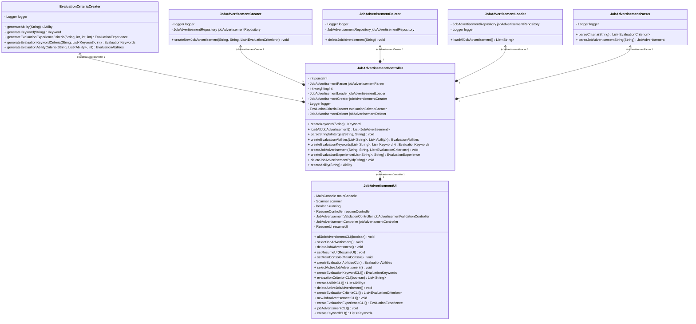

# Einleitung

## Übersicht über die Application
Die Anwendung ist ein System zur Analyse von Lebensläufen von Bewerbern, 
das speziell für Unternehmen entwickelt wurde, die offene Stellen anbieten. 
Sie richtet sich insbesondere an große Unternehmen mit einer hohen Anzahl potenzieller 
Bewerber und unterstützt diese bei der Vorauswahl geeigneter Kandidaten. Ziel ist es, 
basierend auf den Anforderungen der Stellenausschreibung ausschließlich passende Kandidaten
zu identifizieren.
Über eine benutzerfreundliche Konsolenanwendung können neue Jobausschreibungen erstellt 
werden. Dabei hat der Nutzer die Möglichkeit, einen Titel, eine Beschreibung sowie
Bewertungskriterien für die Analyse festzulegen. Alle eingegangenen Lebensläufe können 
in einem vorgesehenen Eingabeordner abgelegt werden. Beim Start der Analyse wird die 
ausgewählte Ausschreibung genutzt, um die Lebensläufe entsprechend der festgelegten 
Kriterien zu bewerten.
Nach Abschluss der Analyse liefert die Anwendung eine vollständige Rangliste aller Bewerber, 
einschließlich ihrer Bewertungspunkte, und bietet so eine strukturierte Grundlage für die
weitere Auswahlentscheidung.
## Wie startet man die Application 
Zum Starten der Anwendung muss die Main-Klasse in der Plugin-Schicht ausgeführt werden.
Zudem müssen im Ressourcen-Ordner Input der Plugin-Schicht die Lebensläufe hochgeladen werden.
Nach dem Start öffnet sich die Konsole. Der Nutzer muss zunächst eine Jobausschreibung erstellen 
und anschließend auswählen. Erst danach beginnt die Analyse der hochgeladenen Lebensläufe.
Das Ergebnis der Analyse wird im Ressourcen-Ordner Output der Plugin-Schicht gespeichert.
Dort befindet sich eine Rangliste der Bewerber in absteigender Reihenfolge nach Punktzahl. 
So kann der Nutzer schnell erkennen, welcher Bewerber die Kriterien am besten erfüllt.

Für das testweise Ausführen der App stehen bereits zwei Lebensläufe zur Analyse bereit. 
Zudem befinden sich zwei Job-Ausschreibungen in der Datenquelle. 
Es besteht jedoch die Möglichkeit, weitere Ausschreibungen zu erstellen.

## Wie testet man die Application
Die geschriebenen Unit-Tests befinden sich im Test-Ordner der einzelnen Projekte. 
Sie können entweder direkt innerhalb der jeweiligen Datei ausgeführt werden oder durch Eingabe des Befehls:
```bash
mvn clean test
```

# Clean Architecture
Die Clean Architecture ist ein Architekturstil für den Aufbau von IT-Anwendungen, 
der sich durch eine klare Trennung von fachlicher Logik und technischer Infrastruktur
auszeichnet. Ziel dieses Ansatzes ist es, die Geschäftslogik der Anwendung unabhängig 
von äußeren Faktoren wie Frameworks, Datenbanken oder Benutzeroberflächen zu halten. 
Dadurch wird die Anwendung leichter testbar, flexibler und einfacher weiterzuentwickeln. 
Die Clean Architecture wird in der Regel in vier Schichten unterteilt. Die innerste Schicht
wird als Domain-Schicht bezeichnet. Diese Schicht enthält die organisationsweit gültige 
Geschäftslogik und die zentralen Entitäten (Entities). Sie repräsentiert die stabilsten 
Bestandteile der Anwendung, die sich am seltensten ändern. Die nächste Schicht enthält
die Anwendungslogik, also die Use Cases der Anwendung. Diese resultieren direkt aus den
Anforderungen und steuern den Fluss der Daten sowie die Interaktionen zwischen den Entitäten,
um die Geschäftsregeln korrekt umzusetzen. Die darauf folgende Schicht, die Adapter-Schicht, 
ist für die Kommunikation zwischen den Use Cases und der Außenwelt zuständig.
Sie wandelt Daten und Anfragen in ein Format um, das von den inneren Schichten 
verstanden und genutzt werden kann. Die äußerste Schicht enthält die technischen 
Details wie Frameworks, Datenbanken, Benutzeroberflächen oder APIs. Diese Schicht 
enthält keinerlei Anwendungslogik und ist darauf ausgelegt, austauschbar zu sein, ohne die Kernlogik der Anwendung 
zu beeinflussen. Wichtig ist bei der Umsetzung der Clean Architecture die Einhaltung 
der Abhängigkeitsregel. Diese besagt, dass Abhängigkeiten immer nur nach innen zeigen dürfen.
Jede Schicht darf nur von Schichten abhängen, die näher am Kern liegen. Dies stellt sicher, 
dass die Geschäftslogik unabhängig von äußeren Technologien bleibt und die Anwendung modular 
aufgebaut ist.

## Analyse der Dependency Rule 

### Positivbeispiel 1
**JobAdvertisementController**

Das erste Beispiel veranschaulicht die Einhaltung der Dependency-Regeln anhand der Klasse 
JobAdvertisementController. Diese befindet sich in der Adapter-Schicht und interagiert mit der
Application-Schicht sowie der Plugin-Schicht. Dieses Design folgt der Clean Architecture, wobei 
die Schichten wie folgt angeordnet sind:
- Unten befindet sich die UI-Schicht, die in der äußeren Schicht liegt.
- Darauf folgt die Adapter-Schicht
- Im inneren Bereich liegt die Application-Schicht.

Die Abhängigkeitsrichtung ist dabei eindeutig: Sie zeigt nur nach innen, 
also von der UI-Schicht zur Adapter-Schicht und von der Adapter-Schicht zur Application-Schicht.

Der JobAdvertisementController greift auf fünf Klassen in der inneren Application-Schicht zu. 
Die UI ruft den Controller nicht direkt auf, sondern wird durch den Controller aufgerufen, 
wodurch die Einhaltung der Abhängigkeitsregel sichergestellt wird.

### Positivbeispiel 2
**ResumeAnalyser**

Die Klasse ResumeAnalyser befindet sich innerhalb der Domain Schicht, und enthält keine 
Abhängigkeiten. So ist zu sehen, dass die Dependency Regeln der Clean Architekture berücksichtigt werden. 

## Analyse der Schichten

### Plugin Schicht
Innerhalb der Plugin-Schicht befindet sich das UI der Anwendung.
Diese Trennung ermöglicht es, die Implementierungsdetails des UI
jederzeit auszutauschen, ohne Änderungen in den inneren Schichten 
vornehmen zu müssen.

Die Klasse AppConsole ist für die Erstellung und
Darstellung der Benutzeroberfläche verantwortlich. 
Sie übernimmt die Aufgabe, Daten aus den inneren 
Schichten abzurufen und diese im UI anzuzeigen. Für die unterschiedliche Darstellung der 
Funktionen ruft, die Klasse Methoden aus der resumeUI und JobAdvertisementUI auf. 

### Domain Schicht
Die Klasse ResumeAnalyser befindet sich in der Domain-Schicht der Clean Architecture, 
da sie die Kernlogik der Anwendung enthält und unabhängig von äußeren Faktoren wie 
Datenbanken, Frameworks oder UI bleibt.
Ihre Aufgabe besteht darin, die Lebensläufe der Nutzer mit den Anforderungen 
einer Job-Ausschreibung zu vergleichen und Übereinstimmungen zu bewerten. 
Da diese Logik auch in später Zukunft keine Änderungen vonnöten sind, bleibt sie unverändert,
selbst wenn sich andere Teile der Anwendung, wie die Datenquelle oder das 
Benutzerinterface, ändern.


# SOLID
## Analyse Single-Responsibility-Principle (SRP)
### Positiv Beispiel

Das Single-Responsibility-Principle (SRP) wird in diesem Design konsequent umgesetzt, da jede Klasse genau eine klar definierte Aufgabe übernimmt:
- EvaluationCriteriaCreater: Verantwortlich für die Erstellung verschiedener Evaluierungskriterien. Die 
Nutzereingaben werden über die Adapterschicht in Objekte umgewandelt und zurückgegeben.
- JobAdvertisementCreater: Erstellt ein neues JobAdvertisement-Objekt.
- JobAdvertisementDeleter: Löscht bestehende Job-Ausschreibungen anhand der übergebenen UUID.
- obAdvertisementLoader: Lädt alle gespeicherten Job-Ausschreibungen aus der Datenbank.
- JobAdvertisementParser: Da die Job-Ausschreibungen als Textdateien gespeichert sind, wandelt diese Klasse die 
  gespeicherten Daten in Objekte um, sodass sie an das UI weitergegeben werden können.

### Negativbeispiel 


Die Klasse ResumeServiceImple ist dabei ein negatives Beispiel, für das Single-Responsibility-Principle.
Die Klasse umfasst mehre Veranwortlichkeiten in sich. Sie umfasst unteranderem die folgenden Punkte:
1. Laden von Lebensläufen aus Dateien
2.	Verwalten und Auswählen von Job-Ausschreibungen 
3.	Parsen von Job-Ausschreibungen
4.	Erstellen von Bewerber-Objekten aus Lebensläufen 
5.	Durchführen der Analyse 

#### Verbesserungsvorschlag


Die Klasse kann in drei weiter Klassen aufgeteilt werden. Dazu enstehen die folgenden Klassen: 
- ResumeLoader: ruft das FileManger auf um alle Lebensläufe zu laden
- JobAdvertismentResiever: holt sich anhand einer Id die passende Jobausschreibung und gibt den Titel für die UI zurück.
- ResumeAnalysisCoordinatior: Die Klasse ResumeAnalysisCoordinator koordiniert den Prozess der Lebenslaufanalyse, indem sie Bewerber aus den Lebensläufen erstellt und die Analyse anhand des ausgewählten Jobangebots durchführt.

## Analyse Open-Closed-Principle (OCP)

### Positivbeispiel

Das folgende UML-Diagramm zeigt das Design zur Erstellung von Bewertungskriterien für Jobangebote. Hierbei existiert das Interface EvaluationCriterionFactory, das die Methode createCriterion definiert. Diese Methode wird verwendet, um verschiedene Bewertungskriterien zu erstellen. Die Methode nimmt einen String für den Namen des Kriteriums und eine Liste mit generischen Werten entgegen, um unterschiedliche Werte für jedes Kriterium zu verarbeiten.
Für jedes Bewertungskriterium wird eine separate Klasse erstellt, die die spezifische Implementierung für dieses Kriterium enthält. Soll ein neues Kriterium hinzukommen, wird einfach eine neue Klasse hinzugefügt, ohne dass Änderungen an der EvaluationCriteriaCreater-Klasse vorgenommen werden müssen. Dies stellt sicher, dass das System offen für Erweiterungen, aber geschlossen für Änderungen bleibt, was den Prinzipien der Softwareentwicklung entspricht.

### Negativbeispiel

Das UML-Diagramm zeigt die Klasse ResumeAnalyser, die für jeden Kriterientyp eine eigene
Methode zur Analyse definiert. Dies führt dazu, dass bei einer Erweiterung der Klasse
– beispielsweise durch das Hinzufügen eines neuen Kriteriums – 
sowohl eine neue Methode zur Analyse dieses Kriteriums als auch ein
zusätzlicher case-Zweig in der Methode getEvaluationCriterionType() 
ergänzt werden muss. Dadurch verstößt die aktuelle Implementierung gegen
das Open-Closed-Principle (OCP), da sie nicht ohne Änderungen erweitert werden kann.
#### Verbesserungsvorschlag

Neue Bewertungskriterien können problemlos erweitert werden, indem eine neue Klasse implementiert wird, die die EvaluationStrategy-Schnittstelle erfüllt, ohne dass die bestehende Klasse verändert werden muss.
## Analyse Dependency-Inversion-Principle (DIP), Interface-Segreggation-Principle (ISP), Liskov-Substitution-Principle (LSP)
In diesem Kapitel wird das Dependency-Inversion-Principle (DIP) Analysiert.
### Positivbeispiel 1
````mermaid
classDiagram
direction BT
class JobAdvertisementCreater {
  - JobAdvertisementRepository jobAdvertisementRepository
  - Logger logger
  + createNewJobAdvertisement(String, String, List~EvaluationCriterion~) void
}
class JobAdvertisementRepository {
<<Interface>>
  + saveJobAdvertisement(JobAdvertisement) void
  + deleteJobAdvertisementById(String) void
  + loadJobAdvertisement() List~String~
  + getJobAdvertisementById(String) String
}
class JobAdvertisementRepositoryImpl {
  - String filePath
  + deleteJobAdvertisementById(String) void
  + loadJobAdvertisement() List~String~
  + getJobAdvertisementById(String) String
  + saveJobAdvertisement(JobAdvertisement) void
}

JobAdvertisementRepositoryImpl  ..>  JobAdvertisementRepository
````
Das zu sehende UML-Diagramm zeigt einen korrekten Einsatz des Dependency Inversion Principle (DIP). Zu sehen sind zwei Klassen: JobAdvertisementCreator in der Application-Schicht und JobAdvertisementRepositoryImpl in der Plugin-Schicht.

Das Problem besteht darin, dass die Klasse JobAdvertisementCreator Methoden aus JobAdvertisementRepositoryImpl benötigt. Da sich diese jedoch in einer tieferliegenden Schicht befindet, darf der Creator gemäß der Dependency Rule keine direkte Referenz darauf haben.

Aus diesem Grund wird nur das Interface angesprochen, das von JobAdvertisementRepositoryImpl implementiert wird. So werden die Methoden der Implementierung nutzbar gemacht, ohne die Abhängigkeitsregeln zu verletzen.

### Positivbeispiel 2

Die UML zeigt ein weiteres Beispiel für das Dependency Inversion Principle (DIP). Dabei muss die Klasse ResumeServiceImpl auf die Klasse FileManager zugreifen, da sie Methoden enthält, die in ResumeServiceImpl benötigt werden.

Statt jedoch direkt auf die konkrete Implementierung von FileManager zuzugreifen, verwendet ResumeServiceImpl lediglich das Interface von FileManager. Dadurch bleibt die Abhängigkeit abstrakt und die Architekturregeln werden eingehalten.

# Weitere Prinzipien

## Analyse GRASP: Geringe Kopplung


### Positivbeispiel

### Negativbeispiel

## Analyse GRASP: Hohe Kohäsion

### Positivbeispiel

### Negativbeispiel

## Don’t Repeat Yourself (DRY)

# Unit Tests

| **Unit Test**                          | **Beschreibung**                                                                                                                                                                                                                                                                                                                                  |
|----------------------------------------|---------------------------------------------------------------------------------------------------------------------------------------------------------------------------------------------------------------------------------------------------------------------------------------------------------------------------------------------------|
| `testAnalyseAbilityContant()`          | Testet die Analyse der Fähigkeiten eines Lebenslaufs eines Bewerbers. Hierbei wird der Abschnitt „Fähigkeiten“ aus dem Lebenslauf als Inhalt verwendet und Mock-Bewertungskriterien für die Bewerberfähigkeiten erstellt. Die Methode wird aufgerufen und überprüft, ob die korrekte Punktzahl für die Fähigkeiten berechnet wird.                |
| `testAnalyseExperienceContant()`       | Testet die Analyse der Erfahrung die ein Bewerber in seinem Lebenslauf angegebene hat. Erstell zunächst eine Liste an EvaluationCriterions, wie sie auch in der Dantebnalne enthalten sind. Weiter wird ein Ausschnit aus einem Lebenslauf genommen und die Analye durchgeführt. Zum Schluss wird geprüft ob die Methode auch korrekt rechnet     |
| `testCreateNewJobAdvertisement()`      | Testet ob das erzeugen von einem neuen JobAdvertisement auch korrket <br/>erfolgt. Dazu wird ein Beipsiel Kriterium erstellt, die Methode createNewJobAdvertisement mit den Werten aus dem SetUp ausfüllt, und geprüft, on ein passenden JibADvertisment Objekt zurück hgegebn wird                                                               |
| `testJobAdvertisementHasId()`          | Prüft, ob das erzeuget JobAdvertisment auch korrekt mit einer gültigen ID erzeugt wird,                                                                                                                                                                                                                                                           |
| `testJobAdvertisementgetDeleted()`     | Prüft, ob das löschen von bestehenden JobAdvertisment anhan der der ID korrket funktioniert.                                                                                                                                                                                                                                                      |
| `testLoadJobAdvertisement()`           | Prüft, ob das laden der Daten erfolgreich erfolgt                                                                                                                                                                                                                                                                                                 |
| `testParseJobAdvertisement()`          | Prüft, on das Parsen von JobAdvertisment aus der Datenbank korrket dumktioneir. Dazu wird ein JobAdvertisment Objekt und daraus ein String JiobAdverisment erstellt, welche in der Datenbank so vorligen. Diese String wird geparst und es werden mehrer asserts durchgeführt um zu Prüfen, das die Objket und das Geparste Objekt identisch sind |

## ATRIP

### Automatic
Für die automatische Testausfürhung, dazu wird das Surefire-Plugin  verwendet, was
Standartmäßig von Maven bereitgestellt wird. Das einzige auf das geachtet werden 
muss ist das die Testklassen korrekt benannt werden, damit die Testklassen automatisch erkannt werden
In Unser Projekt sind die TEstklasse jeweils mit dem Namen der Klasse die getestte wird + Test. Um alle test
auszuführen muss einfach nur der Befehl mvn clean test ausgeführt werden im Terminal

### Thorough

### Professional

## Code Coverage
Für die Analyse des Code Coverage des Projektes wurde das Plugin jacoco verwendet. 
Dabei wird für jede Schicht des Anwendung ein Report erstellt welche alle notwendugn Daten anzeigt. 


## Fakes und Mocks

# Domain Driven Design

## Ubiquitous Language

| **Bezeichnung**       | **Bedeutung**                                                                 | **Begründung** |
|-----------------------|-----------------------------------------------------------------------------|---------------|
| Resume               | Dokument, das die Qualifikationen, Erfahrungen und Fähigkeiten eines Bewerbers beschreibt. | Lebensläufe sind der zentrale Input für das System, und alle Funktionen drehen sich um deren Analyse und Verwaltung. |
| Applicant            | Jeder Bewerber ist einem Lebenslauf und einer Ausschreibung zugeordnet. Durch die Analyse seines Lebenslaufs kann der Bewerber Punkte erhalten, die ihn in der zugehörigen Rangliste der Ausschreibung platzieren. | Bewerber sind ein zentraler Bauteil der Anwendung, die den Lebenslauf und die Rangliste miteinander verknüpfen. |
| Leaderboard          | Die Rangliste ist einer Ausschreibung zugeordnet und zeigt die Bewerber, die sich auf diese Ausschreibung beworben haben, in absteigender Reihenfolge nach erreichter Punktzahl an. | Die Rangliste ist der zentrale Output der Anwendung und liefert den Mehrwert der Anwendung. |
| Job advertisement    | Ausschreibungen können vom Anwender angepasst werden. Sie enthalten den Namen der Ausschreibung sowie die Kriterien, die zur Bewertung der Lebensläufe verwendet werden. Jede Ausschreibung ist einer Rangliste zugeordnet und kann bei Bedarf gelöscht werden. | Jede Ausschreibung definiert die Bewertungsregeln, die für die Analyse der Lebensläufe wichtig sind. |

## Entities

### Identität
Dafür wird ein Surrogatschlüssel verwendet, da zu einem keine passenden 
natürlichen Schlüssel innerhalb der Domäne vorhanden sind 
und die Nutzung eines Surrogatschlüssels einfach umzusetzen ist.

### Applicant
Der Bewerber ist eine Kern-Entity und besitzt eine 
eindeutige Identifikation, die durch eine generierte 
Bewerber-ID realisiert wird.

Zusätzlich hat der Bewerber einen Lebenszyklus, da 
sich sein Zustand während der Anwendung ändern kann. 
Beispielsweise können Punkte, die der Bewerber im Rahmen der 
Lebenslaufanalyse erhält, sowie sein Rang innerhalb einer 
Rangliste dynamisch angepasst werden.

### Job advertisement
Die Ausschreibung beschreibt eine offene Stelle mit spezifischen 
Anforderungen. Sie kann vom Anwender bearbeitet oder gelöscht
werden und ist einer Rangliste zugeordnet. Der Lebenszyklus der 
Anwendung ändert sich durch Änderungen an den Bewertungskriterien.

### Leaderboard
Die Rangliste wird für jede Ausschreibung erstellt und enthält
eine geordnete Liste von Bewerbern basierend auf deren Punktzahl.  
Sie ist eng an die Ausschreibung gekoppelt und bietet die
Übersicht der besten Kandidaten.

Die Rangliste hat eine eigene Identität und kann verwaltet werden. 
Der Inhalt der Liste kann sich in ihrem Lebenszyklus ändern, durch neue Bewerber und 
Änderungen an den Punkten der Bewerber.

## Value Objects

### Resume
Der Lebenslauf enthält alle Informationen eines Bewerbers, die zur
Analyse und Bewertung verwendet werden.

Der Lebenslauf hat keine Identität im System. Er repräsentiert
lediglich eine Sammlung von Daten, die bewertet werden. 
Zwei Lebensläufe mit identischen Attributen sind inhaltlich gleich.

### Evaluationcriteria
Ein Bewertungskriterium definiert die Regeln, nach denen ein 
Lebenslauf bewertet wird.
Kriterien haben keine Identität. Sie sind austauschbare
Bestandteile der Ausschreibung. Zwei Kriterien mit denselben
Attributen sind gleichwertig.

### Points
Die Punktzahl eines Bewerbers zeigt an, wie gut dieser auf eine 
Ausschreibung passt. Die Punkte ergeben sich aus der Analyse der
Lebensläufe.
Punkte sind Ergebnisse der Analyse und hängen ausschließlich von
der Bewertung ab. Sie haben keine Identität.  
