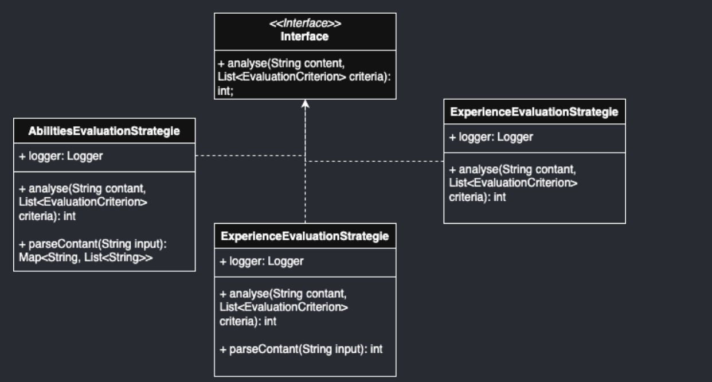
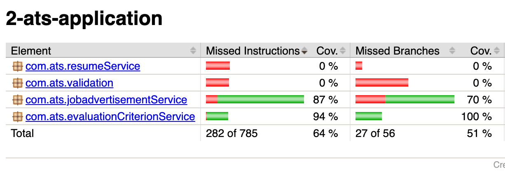
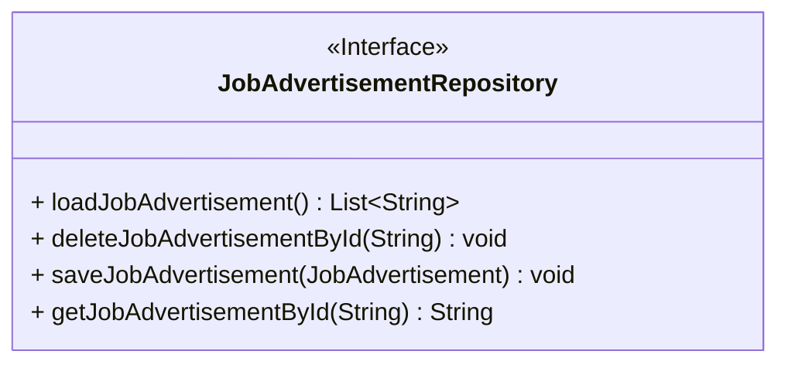
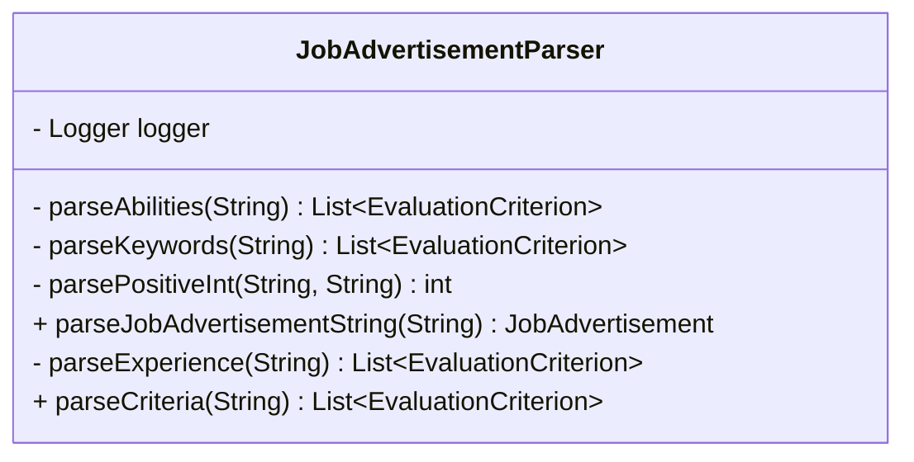
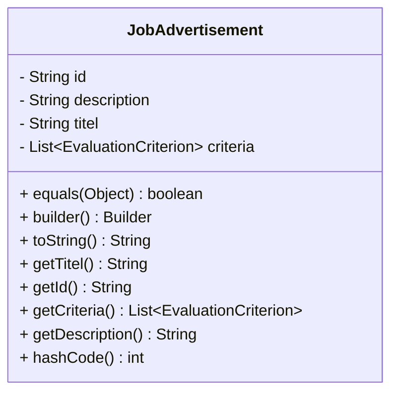
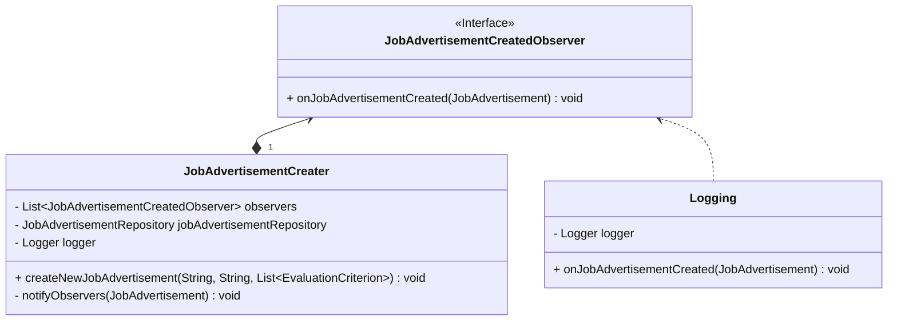

# Programmentwurf - Applicant Tracking System
| Name           | Matrikelnummer | Studiengruppe |
|----------------|----------------|----------------|
| Justin Hubert  | 7654321        | TINF22B2       |
| Luis Bernhardt | 6273748        | TINF22B2       |


# Einleitung

## Übersicht über die Application
Die Anwendung ist ein System zur Analyse von Lebensläufen von Bewerbern, das speziell für Unternehmen entwickelt wurde, die offene Stellen anbieten. Sie richtet sich insbesondere an große Unternehmen mit einer hohen Anzahl potenzieller Bewerber und unterstützt diese bei der Vorauswahl geeigneter Kandidaten. Ziel ist es, basierend auf den Anforderungen der Stellenausschreibung ausschließlich passende Kandidaten zu identifizieren. Über eine benutzerfreundliche Konsolenanwendung können neue Jobausschreibungen erstellt werden. Dabei hat der Nutzer die Möglichkeit, einen Titel, eine Beschreibung sowie Bewertungskriterien für die Analyse festzulegen. Alle eingegangenen Lebensläufe können in einem vorgesehenen Eingabeordner abgelegt werden. Beim Start der Analyse wird die ausgewählte Ausschreibung genutzt, um die Lebensläufe entsprechend der festgelegten Kriterien zu bewerten. Nach Abschluss der Analyse liefert die Anwendung eine vollständige Rangliste aller Bewerber, einschließlich ihrer Bewertungspunkte, und bietet so eine strukturierte Grundlage für die weitere Auswahlentscheidung.

## Wie startet man die Application 
Zum Starten der Anwendung muss die Main-Klasse in der Plugin-Schicht ausgeführt werden. Zudem müssen im Ressourcen-Ordner Input der Plugin-Schicht die Lebensläufe hochgeladen werden. Nach dem Start öffnet sich die Konsole. Der Nutzer muss zunächst eine Jobausschreibung erstellen und anschließend auswählen. Erst danach beginnt die Analyse der hochgeladenen Lebensläufe. Das Ergebnis der Analyse wird im Ressourcen-Ordner Output der Plugin-Schicht gespeichert. Dort befindet sich eine Rangliste der Bewerber in absteigender Reihenfolge nach Punktzahl. So kann der Nutzer schnell erkennen, welcher Bewerber die Kriterien am besten erfüllt. Für das testweise Ausführen der App stehen bereits zwei Lebensläufe zur Analyse bereit. Zudem befinden sich zwei Job-Ausschreibungen in der Datenquelle. Es besteht jedoch die Möglichkeit, weitere Ausschreibungen zu erstellen.

## Wie testet man die Application
Die geschriebenen Unit-Tests befinden sich im Test-Ordner der einzelnen Projekte. 
Sie können entweder direkt innerhalb der jeweiligen Datei ausgeführt werden oder durch Eingabe des Befehls:
```bash
mvn clean test
```

# Clean Architecture
Die Clean Architecture ist ein Architekturstil für den Aufbau von IT-Anwendungen, 
der sich durch eine klare Trennung von fachlicher Logik und technischer Infrastruktur auszeichnet. Ziel dieses Ansatzes ist es, die Geschäftslogik der Anwendung unabhängig von äußeren Faktoren wie Frameworks, Datenbanken oder Benutzeroberflächen zu halten. Dadurch wird die Anwendung leichter testbar, flexibler und einfacher weiterzuentwickeln. Die Clean Architecture wird in der Regel in vier Schichten unterteilt. Die innerste Schicht wird als Domain-Schicht bezeichnet. Diese Schicht enthält die organisationsweit gültige Geschäftslogik und die zentralen Entitäten (Entities). Sie repräsentiert die stabilsten Bestandteile der Anwendung, die sich am seltensten ändern. Die nächste Schicht enthält die Anwendungslogik, also die Use Cases der Anwendung. Diese resultieren direkt aus den Anforderungen und steuern den Fluss der Daten sowie die Interaktionen zwischen den Entitäten, um die Geschäftsregeln korrekt umzusetzen. Die darauf folgende Schicht, die Adapter-Schicht,  ist für die Kommunikation zwischen den Use Cases und der Außenwelt zuständig. Sie wandelt Daten und Anfragen in ein Format um, das von den inneren Schichten verstanden und genutzt werden kann. Die äußerste Schicht enthält die technischen Details wie Frameworks, Datenbanken, Benutzeroberflächen oder APIs. Diese Schicht enthält keinerlei Anwendungslogik und ist darauf ausgelegt, austauschbar zu sein, ohne die Kernlogik der Anwendung zu beeinflussen. Wichtig ist bei der Umsetzung der Clean Architecture die Einhaltung der Abhängigkeitsregel. Diese besagt, dass Abhängigkeiten immer nur nach innen zeigen dürfen. Jede Schicht darf nur von Schichten abhängen, die näher am Kern liegen. Dies stellt sicher, dass die Geschäftslogik unabhängig von äußeren Technologien bleibt und die Anwendung modular aufgebaut ist.

## Analyse der Dependency Rule 

### Positivbeispiel 1
**JobAdvertisementController**

Das erste Beispiel veranschaulicht die Einhaltung der Dependency-Regeln anhand der Klasse 
JobAdvertisementController. Diese befindet sich in der Adapter-Schicht und interagiert mit der
Application-Schicht sowie der Plugin-Schicht. Dieses Design folgt der Clean Architecture, wobei 
die Schichten wie folgt angeordnet sind:
- Unten befindet sich die UI-Schicht, die in der äußeren Schicht liegt.
- Darauf folgt die Adapter-Schicht
- Im inneren Bereich liegt die Application-Schicht.

Die Abhängigkeitsrichtung ist dabei eindeutig: Sie zeigt nur nach innen, 
also von der UI-Schicht zur Adapter-Schicht und von der Adapter-Schicht zur Application-Schicht.

Der JobAdvertisementController greift auf fünf Klassen in der inneren Application-Schicht zu. 
Die UI ruft den Controller nicht direkt auf, sondern wird durch den Controller aufgerufen, 
wodurch die Einhaltung der Abhängigkeitsregel sichergestellt wird.

### Positivbeispiel 2
**ResumeAnalyser**

Die Klasse ResumeAnalyser befindet sich innerhalb der Domain Schicht, und enthält keine 
Abhängigkeiten. So ist zu sehen, dass die Dependency Regeln der Clean Architekture berücksichtigt werden. 

## Analyse der Schichten

### Plugin Schicht
Innerhalb der Plugin-Schicht befindet sich das UI der Anwendung. Diese Trennung ermöglicht es, die Implementierungsdetails des UI jederzeit auszutauschen, ohne Änderungen in den inneren Schichten vornehmen zu müssen.

Die Klasse AppConsole ist für die Erstellung und Darstellung der Benutzeroberfläche verantwortlich. Sie übernimmt die Aufgabe, Daten aus den inneren Schichten abzurufen und diese im UI anzuzeigen. Für die unterschiedliche Darstellung der Funktionen ruft die Klasse Methoden aus der resumeUI und JobAdvertisementUI auf.

### Domain Schicht
Die Klasse ResumeAnalyser befindet sich in der Domain-Schicht der Clean Architecture, da sie die Kernlogik der Anwendung enthält und unabhängig von äußeren Faktoren wie Datenbanken, Frameworks oder UI bleibt. Ihre Aufgabe besteht darin, die Lebensläufe der Nutzer mit den Anforderungen einer Job-Ausschreibung zu vergleichen und Übereinstimmungen zu bewerten. Da diese Logik auch in später Zukunft keine Änderungen vonnöten sind, bleibt sie unverändert, selbst wenn sich andere Teile der Anwendung, wie die Datenquelle oder das Benutzerinterface, ändern.


# SOLID
## Analyse Single-Responsibility-Principle (SRP)
### Positiv Beispiel

Das Single-Responsibility-Principle (SRP) wird in diesem Design konsequent umgesetzt, da jede Klasse genau eine klar definierte Aufgabe übernimmt:
- EvaluationCriteriaCreater: Verantwortlich für die Erstellung verschiedener Evaluierungskriterien. Die 
Nutzereingaben werden über die Adapterschicht in Objekte umgewandelt und zurückgegeben.
- JobAdvertisementCreater: Erstellt ein neues JobAdvertisement-Objekt.
- JobAdvertisementDeleter: Löscht bestehende Job-Ausschreibungen anhand der übergebenen UUID.
- obAdvertisementLoader: Lädt alle gespeicherten Job-Ausschreibungen aus der Datenbank.
- JobAdvertisementParser: Da die Job-Ausschreibungen als Textdateien gespeichert sind, wandelt diese Klasse die gespeicherten Daten in Objekte um, sodass sie an das UI weitergegeben werden können.

### Negativbeispiel 


Die Klasse ResumeServiceImple ist dabei ein negatives Beispiel, für das Single-Responsibility-Principle.
Die Klasse umfasst mehre Veranwortlichkeiten in sich. Sie umfasst unteranderem die folgenden Punkte:
1. Laden von Lebensläufen aus Dateien
2.	Verwalten und Auswählen von Job-Ausschreibungen 
3.	Parsen von Job-Ausschreibungen
4.	Erstellen von Bewerber-Objekten aus Lebensläufen 
5.	Durchführen der Analyse 

#### Verbesserungsvorschlag


Die Klasse kann in drei weiter Klassen aufgeteilt werden. Dazu enstehen die folgenden Klassen: 
- ResumeLoader: ruft das FileManger auf um alle Lebensläufe zu laden
- JobAdvertismentResiever: holt sich anhand einer Id die passende Jobausschreibung und gibt den Titel für die UI zurück.
- ResumeAnalysisCoordinatior: Die Klasse ResumeAnalysisCoordinator koordiniert den Prozess der Lebenslaufanalyse, indem sie Bewerber aus den Lebensläufen erstellt und die Analyse anhand des ausgewählten Jobangebots durchführt.

## Analyse Open-Closed-Principle (OCP)

### Positivbeispiel

Das folgende UML-Diagramm zeigt das Design zur Erstellung von Bewertungskriterien für Jobangebote. Hierbei existiert das Interface EvaluationCriterionFactory, das die Methode createCriterion definiert. Diese Methode wird verwendet, um verschiedene Bewertungskriterien zu erstellen. Die Methode nimmt einen String für den Namen des Kriteriums und eine Liste mit generischen Werten entgegen, um unterschiedliche Werte für jedes Kriterium zu verarbeiten. Für jedes Bewertungskriterium wird eine separate Klasse erstellt, die die spezifische Implementierung für dieses Kriterium enthält. Soll ein neues Kriterium hinzukommen, wird einfach eine neue Klasse hinzugefügt, ohne dass Änderungen an der EvaluationCriteriaCreater-Klasse vorgenommen werden müssen. Dies stellt sicher, dass das System offen für Erweiterungen, aber geschlossen für Änderungen bleibt, was den Prinzipien der Softwareentwicklung entspricht.

### Negativbeispiel

Das UML-Diagramm zeigt die Klasse ResumeAnalyser, die für jeden Kriterientyp eine eigene Methode zur Analyse definiert. Dies führt dazu, dass bei einer Erweiterung der Klasse, beispielsweise durch das Hinzufügen eines neuen Kriteriums, sowohl eine neue Methode zur Analyse dieses Kriteriums als auch ein zusätzlicher case-Zweig in der Methode getEvaluationCriterionType() ergänzt werden muss. Dadurch verstößt die aktuelle Implementierung gegen das Open-Closed-Principle (OCP), da sie nicht ohne Änderungen erweitert werden kann.

#### Verbesserungsvorschlag

Neue Bewertungskriterien können problemlos erweitert werden, indem eine neue Klasse implementiert wird, die die EvaluationStrategy-Schnittstelle erfüllt, ohne dass die bestehende Klasse verändert werden muss.
## Analyse Dependency-Inversion-Principle (DIP), Interface-Segreggation-Principle (ISP), Liskov-Substitution-Principle (LSP)
In diesem Kapitel wird das Dependency-Inversion-Principle (DIP) Analysiert.
### Positivbeispiel 1
````mermaid
classDiagram
direction BT
class JobAdvertisementCreater {
  - JobAdvertisementRepository jobAdvertisementRepository
  - Logger logger
  + createNewJobAdvertisement(String, String, List~EvaluationCriterion~) void
}
class JobAdvertisementRepository {
<<Interface>>
  + saveJobAdvertisement(JobAdvertisement) void
  + deleteJobAdvertisementById(String) void
  + loadJobAdvertisement() List~String~
  + getJobAdvertisementById(String) String
}
class JobAdvertisementRepositoryImpl {
  - String filePath
  + deleteJobAdvertisementById(String) void
  + loadJobAdvertisement() List~String~
  + getJobAdvertisementById(String) String
  + saveJobAdvertisement(JobAdvertisement) void
}

JobAdvertisementRepositoryImpl  ..>  JobAdvertisementRepository
````
Das zu sehende UML-Diagramm zeigt einen korrekten Einsatz des Dependency Inversion Principle (DIP). Zu sehen sind zwei Klassen: JobAdvertisementCreator in der Application-Schicht und JobAdvertisementRepositoryImpl in der Plugin-Schicht.
Das Problem besteht darin, dass die Klasse JobAdvertisementCreator Methoden aus JobAdvertisementRepositoryImpl benötigt. Da sich diese jedoch in einer tieferliegenden Schicht befindet, darf der Creator gemäß der Dependency Rule keine direkte Referenz darauf haben.
Aus diesem Grund wird nur das Interface angesprochen, das von JobAdvertisementRepositoryImpl implementiert wird. So werden die Methoden der Implementierung nutzbar gemacht, ohne die Abhängigkeitsregeln zu verletzen.

### Positivbeispiel 2

Die UML zeigt ein weiteres Beispiel für das Dependency Inversion Principle (DIP). Dabei muss die Klasse ResumeServiceImpl auf die Klasse FileManager zugreifen, da sie Methoden enthält, die in ResumeServiceImpl benötigt werden. Statt jedoch direkt auf die konkrete Implementierung von FileManager zuzugreifen, verwendet ResumeServiceImpl lediglich das Interface von FileManager. Dadurch bleibt die Abhängigkeit abstrakt und die Architekturregeln werden eingehalten.

# Weitere Prinzipien

## Analyse GRASP: Geringe Kopplung

### Positivbeispiel

Die Klasse JobAdvertismentValidation ist für die Validierung der Nutzereingaben zuständig. Zu diesem Zweck implementiert sie mehrere Methoden zur Überprüfung verschiedener Eingabetypen. Die Klasse weist eine geringe Kopplung auf: Sie hängt ausschließlich von Logger und System.out. Es bestehen keine. Abhängigkeiten zu anderen benutzerdefinierten Klassen oder externen Modulen.Zudem ist die Klasse ausschließlich für Validierungszwecke zuständig und enthält keine Geschäftslogik, Persistenz- oder UI-Komponenten. Ein weiterer positiver Aspekt ist, dass der Logger über den Konstruktor injiziert wird, was die Testbarkeit der Klasse verbessert. Ein Verbesserungsvorschlag wäre, dass sich die Klasse ausschließlich auf die Validierung konzentriert und keine direkte Ausgaben mittels System.out.println vornimmt. 

### Negativbeispiel

Die Klasse ResumeController steuert die Verarbeitung und Analyse von Bewerbungsunterlagen im System. Sie koordiniert 
den Ablauf zwischen dem Lebenslauf-Dienst (ResumeServiceImpl) und dem Speichern von Ergebnissen über den FileManager. Ein zentraler Punkt ist die direkte Abhängigkeit von der konkreten Implementierung ResumeServiceImpl. Um eine lose Kopplung zu erreichen und die Austauschbarkeit der Komponenten zu verbessern, sollte stattdessen auf ein Interface (z. B. ResumeService) gesetzt werden.  Zudem greift der Controller direkt auf das öffentliche Feld selectedJobAdvertisement im ResumeServiceImpl zu. Das stellt eine enge Kopplung an die interne Struktur der Service-Klasse dar.

## Analyse GRASP: Hohe Kohäsion

Die Klasse AbilityKeywordCreator hat eine ziemlich hohe Kohäsion, weil alle ihre Methoden auf dasselbe Ziel hinarbeiten: das Erzeugen von Bewertungselementen für Fähigkeiten und Schlüsselwörter. Die Methoden generateAbility() und generateKeyword() verwandeln Texteingaben in passende Objekte, und createEvaluationCriterion() erstellt ein allgemeines Bewertungskriterium. Alle Methoden hängen also thematisch eng zusammen und unterstützen gemeinsam die Verarbeitung und Erstellung dieser Elemente im Bewerbungssystem. Dank dieser klaren Fokussierung ist die Klasse gut strukturiert, einfach zu pflegen und vielseitig einsetzbar
## Don’t Repeat Yourself (DRY)

Zur Anwendung des DRY-Prinzips wurde eine UI-Klasse überarbeitet, in der sich viele wiederholte Codeabschnitte befanden. Solcher mehrfach identischer Code führt dazu, dass bei Änderungen viele Stellen gleichzeitig angepasst werden müssen, was die Wartung erschwert und Fehleranfälligkeit erhöht – allein schon, weil alle betroffenen Stellen zunächst gefunden werden müssen.

### Beispiel 1 (Header)

#### **Vorher:** Dieser Codeblock wurde in mehreren Methoden exakt so wiederholt:

```java
System.out.println(mainConsole.line(header));
System.out.println(mainConsole.header(header));
System.out.println(mainConsole.line(header));
```

#### **Nachher:** Der Code wurde in eine zentrale Methode ausgelagert:

```java
private void printHeader(String header) {
    System.out.println(mainConsole.line(header));
    System.out.println(mainConsole.header(header));
    System.out.println(mainConsole.line(header));
}

// Verwendung:
printHeader("Ausschreibungen");
```
Durch das Auslagern in eine eigene Methode werden Redundanzen verringert die Lesbarkeit der Codes verbessert. Wodurch der Wartungsaufwand minimiert werden. Da Änderungen künftig nur an einer Stelle vorgenommne werden. 

**Commit:** https://github.com/Jstn2004/ASE-Applicant-Tracking-System/commit/d01dd2a4255093d675f7ded9f4cc7b4cdab86a11


# Unit Tests

| **Unit Test**                     | **Beschreibung**                                                                                                                                                                      |
| --------------------------------- |---------------------------------------------------------------------------------------------------------------------------------------------------------------------------------------|
| ApplicantCreaterTest              | Testet, ob Bewerberdaten korrekt aus Lebensläufen extrahiert werden, sowohl für vollständige als auch unvollständige Lebensläufe. Unterstützt auch das Einlesen mehrerer Lebensläufe. |
| ResumeAnalyserTest                | Prüft die Analysefunktion für Lebensläufe. Es werden Kandidaten erstellt, Fähigkeiten und Schlüsselwörter simuliert und die Extraktion sowie Berechnung getestet.                     |
| JobAdvertisementParserTest        | Testet, ob parseJobAdvertisementString eine Stellenanzeige korrekt in ein Objekt umwandelt. Felder wie ID, Titel und Kriterien werden auf Richtigkeit geprüft.                        |
| JobAdvertisementLoaderTest        | Überprüft, ob loadAllJobAdvertisement mit dem Repository korrekt kommuniziert. Verwendet ein Mock-Repository zur Validierung.                                                         |
| JobAdvertisementDeleteTest        | Testet, ob deleteJobAdvertisement korrekt eine Löschanfrage an das Repository weitergibt. Verwendet Mock und verify zur Bestätigung.                                                  |
| JobAdvertisementCreaterTest       | Prüft, ob neue Stellenanzeigen korrekt erstellt, mit ID versehen, gespeichert und an Beobachter weitergegeben werden. Felder werden auf Richtigkeit geprüft.                          |
| EvaluationKeywordFactoryTest      | Testet, ob createCriterion bei gültigen Eingaben ein korrektes Objekt erzeugt und bei ungültigen eine ClassCastException wirft.                                                       |
| EvaluationExperienceFactoryTest   | Testet createCriterion für korrekte Objekterstellung bei gültigen Eingaben. Bei fehlerhaften Listen werden entsprechende Exceptions erwartet.                                         |
| EvaluationAbilitiesFactoryTest    | Überprüft createCriterion auf korrekte Rückgabe eines EvaluationAbilities-Objekts. Name, Fähigkeiten, Gewichtung und Punkte werden validiert.                                         |
| AbilityKeywordCreatorTest         | Testet, ob Methoden zur Erstellung von Fähigkeiten und Schlüsselwörtern korrekt arbeiten. Auch die Zusammenarbeit mit der Evaluationsfabrik wird geprüft.                             |

## ATRIP

### Automatic
Für die automatische Testausführung wird das Surefire-Plugin verwendet, das standardmäßig von Maven bereitgestellt wird. Dabei muss lediglich darauf geachtet werden, dass die Testklassen korrekt benannt sind, damit sie automatisch erkannt werden. In unserem Projekt tragen die Testklassen jeweils den Namen der getesteten Klasse mit dem Suffix Test. Um alle Tests auszuführen, genügt der Befehl mvn clean test im Terminal.

### Thorough

### Positiv Beispiel
```java
@Test
    public void testSavedJobAdvertisementContainsCorrectData() {
        List<EvaluationCriterion> criteria = List.of(new EvaluationCriterion("Experience", 80, 2));
        jobAdvertisementCreater.createNewJobAdvertisement(title, description, criteria);

        ArgumentCaptor<JobAdvertisement> captor = ArgumentCaptor.forClass(JobAdvertisement.class);
        verify(jobAdvertisementRepositoryMock).saveJobAdvertisement(captor.capture());

        JobAdvertisement jobAd = captor.getValue();

        assertEquals(title, jobAd.getTitel());
        assertEquals(description, jobAd.getDescription());
        assertEquals(1, jobAd.getCriteria().size());
        assertEquals("Experience", jobAd.getCriteria().get(0).getName());
    }
```
Die Testmethode testSavedJobAdvertisementContainsCorrectData() ist gründlich (Thorough), da sie nicht nur prüft, ob die Methode aufgerufen wurde, sondern auch den Inhalt des gespeicherten Objekts validiert. Sie stellt sicher, dass Titel, Beschreibung und Kriterien korrekt gesetzt wurden, wodurch nicht nur der Aufruf, sondern auch die inhaltliche Richtigkeit der Objektgenerierung getestet wird.

#### Negativ Beispiel
```java
@Test
    public void testAnalyseExperienceContant() {
        List<EvaluationCriterion> experience = List.of(new EvaluationExperience(
                "Berufserfahrungen",
                80,
                2,
                8
        ));

        String contant = " - Werkstudent Softwareentwicklung bei TechCorp (2022 - 2023)\n" +
                "  - Entwicklung und Wartung von Webanwendungen\n" +
                "  - Optimierung bestehender Codebasis\n" +
                "- Praktikum IT-Support bei ITSolutions (2021 - 2022)\n" +
                "  - Fehleranalyse und Behebung technischer Probleme\n" +
                "  - Kundenberatung und Unterstützung";

        int result = this.analyser.analyseExperienceInResume(contant, experience);
        assertEquals(640, result);
    }
```

Die Testmethode testAnalyseAbilityContant() erfüllt zentrale Anforderungen an die Gründlichkeit, da sie verschiedene Kriteriengruppen und relevante sowie irrelevante Begriffe berücksichtigt. Dadurch geht sie über den einfachen Standardfall hinaus und prüft, ob die Methode relevante Fähigkeiten korrekt erkennt und bewertet.

Allerdings könnten zusätzliche Testfälle die Gründlichkeit noch deutlich verbessern. Der Test enthält keine negativen Szenarien, etwa einen Lebenslauf ohne zutreffende Fähigkeiten oder mit Duplikaten. Auch Grenzfälle wie eine leere Kriterienliste, unvollständige Abschnitte oder falsch formatierte Eingaben werden nicht berücksichtigt.


### Professional

#### Positiv Beispiel

Die Testmethode testSavedJobAdvertisementContainsCorrectData() (siehe Thorough-Positivbeispiel) ist professionell geschrieben, da sie klar strukturiert und leicht verständlich ist. Die verwendeten Namen sind sprechend, es wird mit einem ArgumentCaptor gearbeitet, um den tatsächlichen Inhalt zu prüfen, und die Assertions sind gezielt auf die wichtigsten Datenfelder ausgerichtet. Der Test ist kompakt und vollständig nachvollziehbar.

#### Negativ Beispiel

Die Testmethode testAnalyseExperienceContant() (siehe Thorough-Negativbeispiel) wirkt im Vergleich weniger professionell. Es fehlt eine klare Kommentierung oder nachvollziehbare Aufschlüsselung der erwarteten Punktzahl, sodass unklar bleibt, warum genau 640 erwartet werden. Zudem ist der Name der Textvariablen (contant) fehlerhaft geschrieben, was die Lesbarkeit und Wartbarkeit beeinträchtigt. Die Methode testet zwar korrekt, wirkt aber im Aufbau eher technisch als sauber dokumentiert oder selbsterklärend – was in professionellen Projekten entscheidend ist.

## Code Coverage

Um die Reports zu erstellen: 
```bash
mvn clean test jacoco:reportfi
```

Für die Analyse der Code Coverage des Projekts wurde das Plugin JaCoCo verwendet. Dabei wurde für jede Schicht der Anwendung ein separater Bericht erstellt, der alle relevanten Abdeckungsdaten enthält. Insbesondere wurde für jede Ebene der Clean Architecture ein eigener Report generiert.

Im Folgenden werden die Ergebnisse der Schichten dargestellt, in denen Tests vorhanden sind. Es zeigt sich, dass Unit-Tests ausschließlich in der Application- und Domain-Schicht vorhanden sind. Der Grund dafür liegt darin, dass sich in diesen Schichten die zentrale Logik und Funktionalität der Anwendung befindet. Diese enthalten den größten Teil des implementierten Codes, der für das Verhalten der Anwendung wesentlich ist, und sind daher besonders testrelevant.



In der Applikationsschicht zeigt sich, dass vor allem die Services zur Erstellung und Verarbeitung von Job­ausschreibungen getestet wurden. Diese bilden einen zentralen Aspekt der Anwendung ab, mit einer insgesamt soliden Testabdeckung.


Das zweite Bild zeigt die Testabdeckung der Domain­schicht. Hier wurde hauptsächlich der Service – also die Kernlogik – abgedeckt, während andere Teile weitgehend ungetestet bleiben.


## Fakes und Mocks

### Beispiel 1 (JobAdvertisementLoaderTest)

In den Tests wird Mockito verwendet, um das JobAdvertisementRepository zu mocken. Dadurch wird vermieden, dass 
echte Datenbankzugriffe stattfinden, was die Tests schnell und unabhängig von externen Systemen macht. Statt komplexem Setup kommen realistische, aber einfache Fake-Daten wie zum Beispiel title = "Software Engineer" oder eine List<EvaluationCriterion> zum Einsatz. Das sorgt für übersichtliche und gut wartbare Tests.

# Domain Driven Design

## Ubiquitous Language

| **Bezeichnung**       | **Bedeutung**                                                                 | **Begründung** |
|-----------------------|-----------------------------------------------------------------------------|---------------|
| Resume               | Dokument, das die Qualifikationen, Erfahrungen und Fähigkeiten eines Bewerbers beschreibt. | Lebensläufe sind der zentrale Input für das System, und alle Funktionen drehen sich um deren Analyse und Verwaltung. |
| Applicant            | Jeder Bewerber ist einem Lebenslauf und einer Ausschreibung zugeordnet. Durch die Analyse seines Lebenslaufs kann der Bewerber Punkte erhalten, die ihn in der zugehörigen Rangliste der Ausschreibung platzieren. | Bewerber sind ein zentraler Bauteil der Anwendung, die den Lebenslauf und die Rangliste miteinander verknüpfen. |
| Leaderboard          | Die Rangliste ist einer Ausschreibung zugeordnet und zeigt die Bewerber, die sich auf diese Ausschreibung beworben haben, in absteigender Reihenfolge nach erreichter Punktzahl an. | Die Rangliste ist der zentrale Output der Anwendung und liefert den Mehrwert der Anwendung. |
| Job advertisement    | Ausschreibungen können vom Anwender angepasst werden. Sie enthalten den Namen der Ausschreibung sowie die Kriterien, die zur Bewertung der Lebensläufe verwendet werden. Jede Ausschreibung ist einer Rangliste zugeordnet und kann bei Bedarf gelöscht werden. | Jede Ausschreibung definiert die Bewertungsregeln, die für die Analyse der Lebensläufe wichtig sind. |

## Entities

### Identität
Dafür wird ein Surrogatschlüssel verwendet, da zum einen keine passenden natürlichen Schlüssel innerhalb der Domäne vorhanden sind und zum anderen die Nutzung eines Surrogatschlüssels einfach umzusetzen ist.

### Applicant
Der Bewerber ist eine Kern-Entity und besitzt eine eindeutige Identifikation, die durch eine generierte Bewerber-ID realisiert wird. Zusätzlich hat der Bewerber einen Lebenszyklus, da sich sein Zustand während der Anwendung ändern kann. Beispielsweise können Punkte, die der Bewerber im Rahmen der Lebenslaufanalyse erhält, sowie sein Rang innerhalb einer Rangliste dynamisch angepasst werden.

### Job advertisement
Die Ausschreibung beschreibt eine offene Stelle mit spezifischen Anforderungen. Sie kann vom Anwender bearbeitet oder gelöscht werden und ist einer Rangliste zugeordnet. Der Lebenszyklus der Anwendung ändert sich durch Änderungen an den Bewertungskriterien.

### Leaderboard
Die Rangliste wird für jede Ausschreibung erstellt und enthält eine geordnete Liste von Bewerbern basierend auf deren Punktzahl. Sie ist eng an die Ausschreibung gekoppelt und bietet die Übersicht der besten Kandidaten. Die Rangliste hat eine eigene Identität und kann verwaltet werden. Der Inhalt der Liste kann sich in ihrem Lebenszyklus ändern, durch neue Bewerber und Änderungen an den Punkten der Bewerber.

### Evaluationcriteria
EvaluationCriterion ist eine Entität, weil jedes Kriterium als individuelles, unterscheidbares Objekt im System behandelt wird. Auch wenn zwei Kriterien den gleichen Namen, die gleiche Punktzahl und Gewichtung haben, werden sie dennoch als getrennte Objekte betrachtet. Ihre Identität ergibt sich also nicht nur aus ihren Attributwerten, sondern durch ihre Eigenständigkeit im Lebenszyklus der Anwendung

## Value Objects

### Resume
Der Lebenslauf enthält alle Informationen eines Bewerbers, die zur Analyse und Bewertung verwendet werden. Der Lebenslauf hat keine Identität im System. Er repräsentiert lediglich eine Sammlung von Daten, die bewertet werden. Zwei Lebensläufe mit identischen Attributen sind inhaltlich gleich.

### Ability

Ist ein Value Object, weil sie keine eigene Identität hat und nur durch ihre Werte beschrieben wird. Zwei Fähigkeiten mit dem gleichen Namen gelten als gleich, unabhängig davon, wann sie erstellt wurden. 

### Keyword
Ist ein Value Object, weil sie nur durch ihre Werte beschrieben wird. Sie hat keine eigene Identität, ist unveränderlich und zwei Keywords mit dem gleichen Inhalt und den gleichen Punkten gelten als gleich.


# Refactoring

## Code Smells
Diese Code Smells werden anhand der Klasse ResumeAnalyser.java dargestellt, da diese Klasse mehrere solcher Probleme direkt aufweist.

### Duplicate Code
```java
// In analyseAbilitiesInResume()
tempPoints.accumulateAndGet(weighting, (a, b) -> a * b);
points.addAndGet(tempPoints.get());

// In analyseExperienceInResume()
points += evaluationPoints * weighting;

// In analyseKeywordsInResume()
tempPoints.accumulateAndGet(weighting, (a, b) -> a * b);
points.addAndGet(tempPoints.get());
```
Der Code zeigt die Berechnung der Punkte für verschiedene Inhalte im Lebenslauf. Dabei wird die Logik zur Punkte- und Gewichtungsermittlung in jeder Methode manuell wiederholt. Das führt dazu, dass bei Änderungen an der Berechnungslogik mehrere Stellen im Code angepasst werden müssen, was fehleranfällig und wartungsintensiv ist.
#### Verbesserung
Eine zentrale Methode für die Berechnung der Punkte und Gewichtung, um nur an einer Stelle Änderungen vornehemen zu müssen. 
```java
public int calculateWeightedPoints(int basePoints, int weighting) {
    return basePoints * weighting;
}
```
### Long Method
```java
   public List<Applicant> analyseResume(List<Applicant> applicantList, JobAdvertisement selectedJobAdvertisement) {

  logger.info("Analysing Resume for " + selectedJobAdvertisement);
  logger.info("Applicant list: " + applicantList);
  String sectionRegex = "(?<=\\n|^)##\\s*([A-Za-zÄÖÜäöüß\\s&]+)\\s*(?=\\n)([\\s\\S]+?)(?=\\n##|\\z)";
  Pattern pattern = Pattern.compile(sectionRegex);


  applicantList.forEach(applicant -> {
    int points = 0;
    Matcher matcher = pattern.matcher(applicant.getResume().getContant());
    List<String[]> sections = new ArrayList<>();

    while (matcher.find()) {
      String title = matcher.group(1).trim();
      String content = matcher.group(2).trim();
      sections.add(new String[] {title, content});
    }

    points += analyseAbilitiesInResume(sections.get(0)[1], getEvaluationCriterionType(selectedJobAdvertisement.getCriteria(),"ABILITIES"), applicant);
    points += analyseExperienceInResume( sections.get(1)[1], getEvaluationCriterionType(selectedJobAdvertisement.getCriteria(),"EXPERIENCE"));
    points += analyseKeywordsInResume( sections.get(2)[1], getEvaluationCriterionType(selectedJobAdvertisement.getCriteria(),"KEYWORDS"));
    applicant.setPoints(points);
  });
  return applicantList;
}
```
Die Methode analyseResume(...) in der Klasse ResumeAnalyser ist sehr lang und übernimmt zu viele Verantwortlichkeiten auf einmal. Die Methode enthält mehrere ineinandergeschachtelte Aufgaben: Sie verarbeitet den vollständigen Lebenslauftext mit einem komplexen Regex, um die einzelnen Abschnitte (Abilities, Experience, Keywords) zu extrahieren. Danach wird über jeden Bewerber iteriert und jeweils: Fähigkeiten analysiert, Berufserfahrung verglichen, Schlagwörter gesucht. Abschließend werden auf Basis der Analysen Punkte berechnet und direkt dem Bewerber zugewiesen.

#### Verbesserung
Um diese Probleme zu lösen, sollte die Methode in kleinere, klar abgegrenzte Teilmethoden zerlegt werden.
```java
public List<Applicant> analyseResume(List<Applicant> applicantList, JobAdvertisement selectedJobAdvertisement) {
    foreach (applicant in applicantList) {
        List<Section> sections = extractSections(applicant.getResume().getContent());
        int totalPoints = calculateTotalPoints(sections, selectedJobAdvertisement);
        assignPointsToApplicant(applicant, totalPoints);
    }
    return applicantList;
}
```
In der Methode analyseResume wird für jeden Bewerber zunächst der Lebenslauf in thematische Abschnitte zerlegt. Anschließend werden die Inhalte dieser Abschnitte analysiert und auf Basis des gewählten Jobangebots eine Gesamtpunktzahl berechnet. Zum Schluss wird diese Punktzahl dem jeweiligen Bewerber zugewiesen.

## 2 Refactorings

### Extract Method
UML vorher

UML nachher

Die Klasse und ihre Methoden waren zuvor sehr groß, unübersichtlich und enthielten duplizierten Code, was Lesbarkeit und Wartbarkeit deutlich einschränkte. Durch die Aufteilung der Methode analyseResume(...) in kleinere, klar benannte Methoden wie compileSectionPattern(), extractSections(...), calculateTotalPoints(...) und assignPointsToApplicant(...) wurde die Struktur verbessert. Jede Methode erfüllt nun eine eindeutige Aufgabe und kann leichter getestet oder wiederverwendet werden.

Commit: https://github.com/Jstn2004/ASE-Applicant-Tracking-System/commit/6148ac0fb3ef30f19f3a93047b90da8b53ad997d

### Replace ErrorCode with Exception

Zuvor wurde bei Fehlern in der Verarbeitung lediglich null zurückgegeben oder potenzielle Fehler gar nicht erst abgefangen. Dadurch konnten Probleme unbemerkt bleiben oder zu unerwarteten Laufzeitfehlern führen. Aus diesem Grund wurde das Refactoring Replace Error Code with Exception angewendet. Anstelle von Rückgabewerten wie null werden nun gezielt aussagekräftige Exceptions geworfen, um Fehler frühzeitig zu erkennen und klar zu kommunizieren. Dadurch wird die Fehlerbehandlung robuster, nachvollziehbarer und sicherer für den weiteren Programmfluss.

Commit: https://github.com/Jstn2004/ASE-Applicant-Tracking-System/commit/7d6b8e1241e12f25f367aa76e05735abe68560ba


# Entwurfsmuster

## Erbauer

Die Klasse JobAdvertisement enthält das Entwurfsmuster des Erbauers. Die Klasse hatte einen sehr großen Konstruktor und enthält unterschiedliche Attribute. Diese haben den Nachteil, dass der Code sehr schnell unübersichtlich ist und nur schwer erweitert werden kann – was bei der Erstellung von Bewertungen schnell zu möglichen Änderungen führen kann. Der Erbauer ermöglicht eine schnelle und einfachere Erweiterung und bietet einen übersichtlichen Code, besonders bei der Eingabe, wenn man leicht Fehler bei der Reihenfolge macht oder die falschen Datentypen übergibt. 

## Beobachter

Das Beobachter-Entwurfsmuster wurde gewählt, um eine lose Kopplung zwischen Klassen zu ermöglichen und das System flexibel erweiterbar zu halten. Neue Beobachter können einfach hinzugefügt werden, ohne den Sender ändern zu müssen. Im Code wurde ein Observer-Interface definiert, das vom LoggingObserver implementiert wird. Der JobAdvertisementCreater agiert als Sender und benachrichtigt alle registrierten Beobachter, sobald eine neue Jobanzeige erstellt wurde. So bleibt die Geschäftslogik sauber und unabhängig von technischen Details – ganz im Sinne der Clean Architecture.

